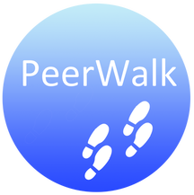

# PeerWalk Backend

These are the backend files for Peerwalk, a safety walk application that helps college students to walk back home safely at night. [Check out the GitHub repo for the overall app here!](https://github.com/Asap7772/PeerWalk)

## What it does
PeerWalk is an app tailored for college students, to connect with other registered students to walk back in pairs or groups. Our powerful algorithm calculates the optimum meeting spot, and matches the user with students who are close by, or are passing by the student's destination.

## Inspiration
Just a few days ago, as one of our teammates was on his way back home from the library after late night of studying, he received a notification that there had been a shooting right outside his dorm. Many times, we've received alarming notifications about assaults, muggings and robberies nearby. Despite there being services on campus such as trained staff who are meant to escort the students back to their dorms. However, there is a lengthy wait time before a student has access to these services. This is why we built PeerWalk.

## How we built it
We decided to build a mobile app using React Native, as it gave us flexibility to develop both on Android and on iOS, as well as access to many third party plugins and libraries.
We allow students to log in using Facebook, and have a mechanism to verify that the user is a student by confirming their status through their '.edu' email ID.
We built a fully functional map ecosystem using the Google Maps API and the Google Places API. Our database was constructed with Google Firebase.

## Challenges we ran into
Integrating the map ecosystem into our application was challenging, as the Google API was tailored to Swift or Java for mobile applications. Converting the destination into its coordinates often was challenging too.

## Accomplishments that we're proud of
We built an app that we as students would use on a daily basis. We accomplished developing a matching algorithm which would get more efficient as our dataset grows.

## What we learned
All of us learned something new this hackathon. For example, two out of the four of us had never used Javascript before, but at the end, all of us could develop parts of the application using React Native. We also learned and leveraged new API's.

## What's next for PeerWalk
Further development to account for wait-times and scheduling walks at a particular time would be two features that we did not have time to implement. We also plan on implementing safety features in-app.

## Built With: 
Facebook API, Expo, React Native, Google Cloud Firebase, Google Maps API
